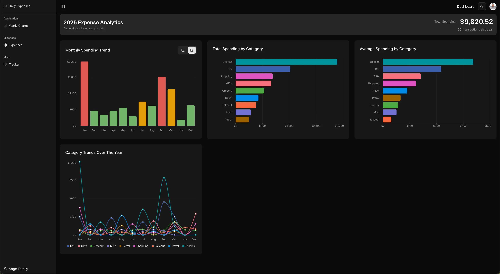
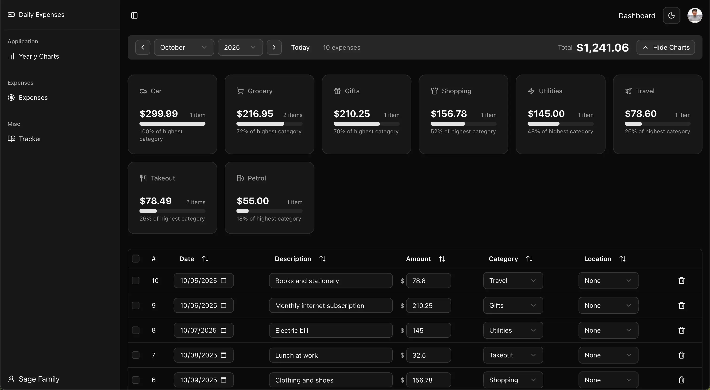
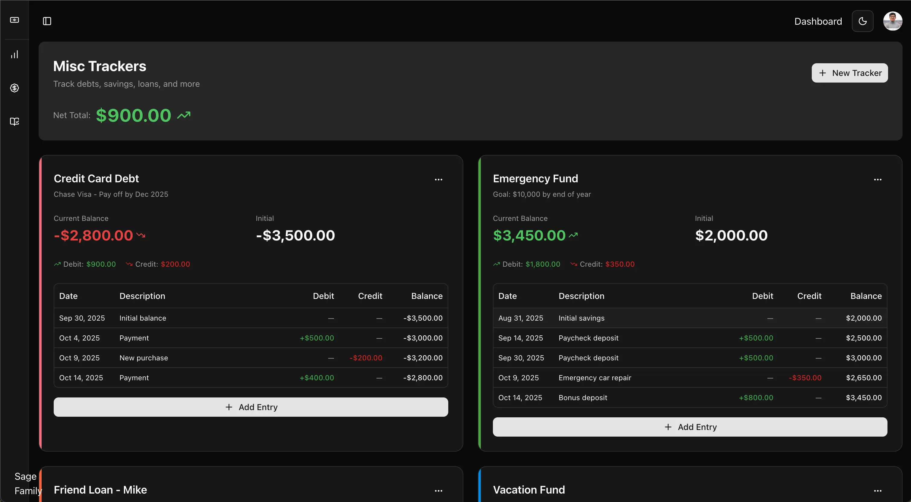

# Daily Expenses Tracker

A modern, self-hosted expense tracking application built with Next.js, Supabase, and shadcn/ui. Track your daily expenses with meaningful charts, categorize spending, and gain insights into your financial habits. Furthermore, you may track debts, savings, loans, and any financial goals outside of daily expenses. Each tracker maintains a running balance with debit (money in) and credit (money out) entries, giving you a clear view of your financial progress over time.

| Dashboard | Expenses | Trackers |
|------------|-----------|--------------|
|  |  |  

## ✨ Features

- **Meaningful Yearly Charts** - Visualize spending with interactive charts over the year
- **Monthly View** - Track expenses month by month
- **Members, Categories & Tags** - Organize expenses by family members, category and location
- **Dark Mode** - UI in both light and dark themes
- **Password Protected** - Simple password protection for your data
- **Responsive** - Works on desktop, tablet, and mobile
- **Yearly Analytics** - Comprehensive yearly spending insights
- **Debt Repayment**: Credit cards, personal loans, or money owed
- **Savings Goals**: Emergency fund, vacation savings, house down payment
- **Friend Loans**: Money lent or borrowed from friends/family
- **Project Funds**: Budget tracking for specific projects or goals


## 🚀 Getting Started

### Prerequisites

Before you begin, ensure you have the following installed:

#### 1. **Node.js** (v18 or higher)
- Download from [nodejs.org](https://nodejs.org/)
- Verify installation:
  ```bash
  node --version
  # Should output: v18.x.x or higher
  ```

#### 2. **pnpm** (Package Manager)
Install pnpm globally:
```bash
npm install -g pnpm
```
Verify installation:
```bash
pnpm --version
# Should output: 8.x.x or higher
```

> **Note:** You can also use `npm` or `yarn` instead of `pnpm`. Just replace `pnpm` with your preferred package manager in all commands.

---

## 📦 Installation

### Step 1: Clone the Repository

```bash
git clone https://github.com/Usmansagemode/daily-expenses-tracker
cd daily-expenses-tracker
```

### Step 2: Install Dependencies

```bash
pnpm install
```

### Step 3: Set Up Supabase

#### 3.1 Create a Supabase Account

1. Go to [supabase.com](https://supabase.com)
2. Click **"Start your project"**
3. Sign in with **GitHub** or **Email**
4. Click **"New Project"**

#### 3.2 Create a New Project

Fill in the following:
- **Name**: `daily-expenses` (or any name you prefer)
- **Database Password**: Generate a strong password (save it securely!)
- **Region**: Choose the closest region to you
- **Pricing Plan**: Select **Free** tier

Click **"Create new project"** and wait ~2 minutes for setup.

#### 3.3 Get Your API Credentials

Once your project is ready:
1. Click on **Project Settings** (gear icon in sidebar)
2. Navigate to **API** section
3. Copy the following:
   - **Project URL** (under "Project URL")
   - **anon public** key (under "Project API keys")

#### 3.4 Create Database Tables

1. Go to **SQL Editor** in Supabase dashboard
2. Click **"New Query"**
3. Copy and paste the following SQL:

```sql
-- Expenses table
 -- Drop the existing table (this will delete all data)
DROP TABLE expenses;

-- Recreate with camelCase
CREATE TABLE expenses (
  id TEXT PRIMARY KEY,
  amount NUMERIC(10,2) NOT NULL,
  "categoryId" TEXT,
  "tagId" TEXT,
  date DATE NOT NULL,
  description TEXT,
  "createdAt" TIMESTAMPTZ DEFAULT NOW(),
  "updatedAt" TIMESTAMPTZ DEFAULT NOW()
);

-- Disable RLS
ALTER TABLE expenses DISABLE ROW LEVEL SECURITY;

-- Insert sample expense (not required)
INSERT INTO expenses (id, amount, "categoryId", "tagId", date, description) VALUES
('1', 127.45, '1', 'costco', '2025-10-14', 'Weekly groceries at Costco');

-- Trackers table
create table if not exists public."trackers" (
  "id" uuid primary key default gen_random_uuid(),
  "title" text not null,
  "description" text,
  "initialBalance" numeric(12, 2) not null default 0,
  "currentBalance" numeric(12, 2) not null default 0,
  "color" text,
  "createdAt" timestamp with time zone not null default timezone('utc'::text, now()),
  "updatedAt" timestamp with time zone not null default timezone('utc'::text, now())
);

-- Tracker entries table
create table if not exists public."trackerEntries" (
  "id" uuid primary key default gen_random_uuid(),
  "trackerId" uuid not null references public."trackers"("id") on delete cascade,
  "date" date not null,
  "description" text,
  "debit" numeric(12, 2) not null default 0,
  "credit" numeric(12, 2) not null default 0,
  "balance" numeric(12, 2) not null default 0,
  "createdAt" timestamp with time zone not null default timezone('utc'::text, now())
);

```

4. Click **"Run"** to execute the queries

### Step 4: Configure Environment Variables

Create a `.env.local` file in the root directory:

```bash
# App Password Protection
APP_PASSWORD=your_secure_password_here

# Supabase Configuration
NEXT_PUBLIC_SUPABASE_URL=https://xxxxx.supabase.co
NEXT_PUBLIC_SUPABASE_ANON_KEY=eyJxxxxxxxxxxx...
```

**Replace:**
- `your_secure_password_here` → Your chosen password for the app. You only need this if you are hosting this to Vercel and want some security.
- `https://xxxxx.supabase.co` → Your Supabase Project URL
- `eyJxxxxxxxxxxx...` → Your Supabase anon public key

> ⚠️ **Important:** Never commit `.env.local` to GitHub! It's already in `.gitignore`.

### Step 5: Run the Development Server

```bash
pnpm dev
```

Open [http://localhost:3000](http://localhost:3000) in your browser.

You should see the login page. Enter your `APP_PASSWORD` to access the app!

---

## 🎨 Customizing Members, Categories & Tags

### Option 1: Update Default Data (Before First Run)

Categories are meant to represent broad spending types (e.g., food, transport, utilities), while tags can be used for specific vendors or locations (e.g., Walmart, Target, Amazon).
Simply update the lists in src/entities/Expense.ts to match your personal or project requirements. 
The intention for Members is to be able to set who paid for the expense. This will enable you to see how much a certain family member/friend is paying.


Edit `src/entities/Expense.ts`:
```typescript
export const DEFAULT_CATEGORIES: Category[] = [
  { id: '1', name: 'Grocery', createdAt: new Date('2025-01-01') },
  { id: '2', name: 'Petrol', createdAt: new Date('2025-01-01') },
  // Add your own categories here
];

export const DEFAULT_TAGS: Tag[] = [
  { id: "costco", name: "Costco", createdAt: new Date("2025-01-01") },
  { id: "aldi", name: "Aldi", createdAt: new Date("2025-01-01") },
  // Add your own locations here
];

// Default members to choose who paid
export const DEFAULT_MEMBERS: Member[] = [
  {
    id: "1",
    fullName: "Roronoa Zoro",
    name: "Zoro",
    createdAt: new Date("2025-01-01"),
  },
  {
    id: "2",
    fullName: "Monkey D. Luffy",
    name: "Luffy",
    createdAt: new Date("2025-01-01"),
  },
];

```

## 🖼️ App Icon / Favicon

You can customize the favicon (the small icon shown in browser tabs) to match your brand or theme.  
Replace the default icon file at:

`/public/favicon.ico`

For best results, use a 512x512 PNG and convert it to .ico using a free tool like favicon.io.

---

## 🚀 Deploying to Vercel

### Step 1: Push to GitHub

1. Create a new repository on [GitHub](https://github.com/new)
2. Push your code:

```bash
git init
git add .
git commit -m "Initial commit"
git branch -M main
git remote add origin https://github.com/yourusername/daily-expenses-tracker.git
git push -u origin main
```

### Step 2: Deploy to Vercel

1. Go to [vercel.com](https://vercel.com)
2. Click **"Add New Project"**
3. **Import** your GitHub repository
4. Click **"Deploy"**

### Step 3: Set Environment Variables in Vercel

1. Go to your project in Vercel
2. Navigate to **Settings** → **Environment Variables**
3. Add the following:
   - `APP_PASSWORD` → Your secure password
   - `NEXT_PUBLIC_SUPABASE_URL` → Your Supabase URL
   - `NEXT_PUBLIC_SUPABASE_ANON_KEY` → Your Supabase anon key
4. Click **"Save"**
5. **Redeploy** your project (Deployments → ⋯ → Redeploy)

### Step 4: Access Your App

Your app will be live at: `https://your-project-name.vercel.app`

> 🔒 **Security Tip:** Your app is now password-protected. Only share the password with people you trust!

---

## 🔒 Security Best Practices

### For Local Development:
- Keep `.env.local` private (never commit it)
- Use a strong `APP_PASSWORD`
- Keep your database password secure

### For Production:
1. **Use a strong APP_PASSWORD** (at least 12 characters)
2. **Enable HTTPS** (Vercel does this automatically)
3. **Don't share your password publicly**
4. **Regularly backup your Supabase database**
   - Go to Supabase → Database → Backups

### Optional: Add IP Whitelisting
If you want extra security, you can restrict access to specific IPs in Vercel:
1. Go to **Settings** → **Firewall**
2. Add your home/work IP addresses

---

## 📚 Tech Stack

- **Framework:** [Next.js 15](https://nextjs.org/) (App Router)
- **Database:** [Supabase](https://supabase.com/) (PostgreSQL)
- **Styling:** [Tailwind CSS](https://tailwindcss.com/)
- **UI Components:** [shadcn/ui](https://ui.shadcn.com/)
- **Charts:** [Recharts](https://recharts.org/)
- **Tables:** [TanStack Table](https://tanstack.com/table)
- **State Management:** [TanStack Query (React Query)](https://tanstack.com/query)
- **Type Safety:** TypeScript

---

## 📖 Usage Guide

### Adding an Expense
1. Click **"Add Expense"** button
2. Fill in:
   - **Date**: When the expense occurred
   - **Category**: Type of expense (Grocery, Takeout, etc.)
   - **Location**: Where you spent (optional)
   - **Amount**: How much you spent
   - **Description**: Notes about the expense (optional)
3. Click 'Save Changes' to store updates to the database!

### Viewing Analytics
- Navigate to **Yearly Charts** to see:
  - Monthly spending trends for the year
  - Category breakdowns
  - Average spending per category
  - Spending over time
  - And many more to come

### Managing Categories
Categories and tags are stored locally for simplicity since they rarely change once set up.
Keeping them client-side avoids unnecessary database queries and keeps the app fast.
However, avoid removing categories that are already used in stored expenses, as that may lead to mismatched or meaningless charts. Or at least keep the minimum count of categories and tags the same.

### Managing Trackers
Trackers let you manage finances beyond daily expenses — like debts, loans, savings goals, or any running balance you want to track.

1. Click **“Add Tracker”** to create a new tracker (e.g., “Vacation Savings”, “Credit Card”, “Car Loan”).
2. Add entries to record debits (money added) or credits (money spent).
3. Each tracker automatically maintains a **running balance**.
4. You can **edit**, **delete**, or **clean up** entries (remove empty or zero-value records) anytime.
5. The **color bar** on the left helps you visually distinguish between different trackers.


---

## 🛠️ Development

### Project Structure
```
daily-expenses-tracker/
├── src/
│   ├── app/                    # Next.js app router pages
│   │   ├── expenses/          # Expenses table page
│   │   ├── yearly-charts/     # Analytics page
│   │   ├── trackers/          # Track debts, savings, loans etc table page
│   │   └── login/             # Login page
│   ├── components/            # React components
│   │   ├── ui/               # shadcn/ui components
│   │   ├── yearly-charts/           # Chart components
│   │   └── expenses/         # Expense-related components
│   │   └── trackers/         # Track-related components
│   ├── entities/             # Data models & types
│   ├── hooks/                # Custom React hooks
│   ├── lib/                  # Utilities & Supabase client
│   └── middleware.ts         # Password protection middleware
├── .env.local                # Environment variables (not in git)
├── package.json
└── README.md
```

### Available Scripts

```bash
# Development
pnpm dev          # Start dev server (localhost:3000)

# Build
pnpm build        # Build for production
pnpm start        # Start production server

# Linting
pnpm lint         # Run ESLint
```

### Adding New Features

Want to extend the app? Here are some ideas:
- 💳 Budget limits per category
- 📧 Email reports
- 👥 Multi-user support with proper auth
- 📊 More chart types
- 📤 Export to CSV/Excel
- 🔔 Spending alerts

---

## 🤝 Contributing

Contributions are welcome! Please feel free to submit a Pull Request.

1. Fork the repository
2. Create your feature branch (`git checkout -b feature/AmazingFeature`)
3. Commit your changes (`git commit -m 'Add some AmazingFeature'`)
4. Push to the branch (`git push origin feature/AmazingFeature`)
5. Open a Pull Request

---

## 🙏 Acknowledgments

- [shadcn/ui](https://ui.shadcn.com/) for beautiful UI components
- [Supabase](https://supabase.com/) for the awesome backend
- [Vercel](https://vercel.com/) for seamless deployment

---

## 📧 Support

If you have questions or run into issues:
1. Check existing [GitHub Issues](https://github.com/yourusername/daily-expenses-tracker/issues)
2. Create a new issue with detailed information
3. Star ⭐ the repo if you find it helpful!

---

## 🗺️ Roadmap

- [ ] Multi-currency support
- [ ] Budget tracking
- [ ] Mobile app (React Native)
- [ ] Receipt upload & OCR
- [ ] Multi-user/family sharing
- [ ] Export reports (PDF, CSV)

## 🪪 License
This project is open-source and available under the [MIT License](./LICENSE).

## 🤝 Contributing
Contributions, issues, and feature requests are welcome!
Feel free to open a [discussion](../../discussions) or [pull request](../../pulls).


---

**Made with care and love by Usman Khalid Mian**

[⬆ Back to top](#-daily-expenses-tracker)
